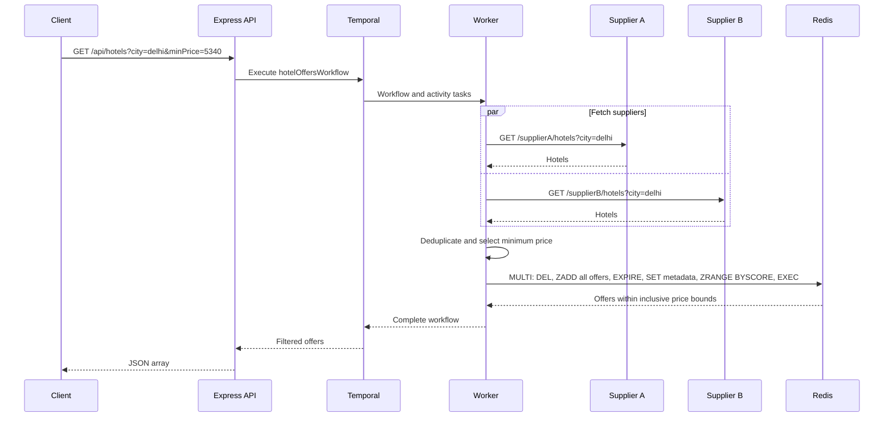

# Hotel Offer Orchestrator

A TypeScript and Express API that uses Temporal to compare two mock hotel suppliers, keep the cheapest offer for each hotel, and filter the saved results by price inside Redis.

## Run with Docker Compose

Requires Docker Engine or Docker Desktop with Compose v2. No local Node.js, Redis, or Temporal installation is needed for this path.

```sh
cp .env.example .env
docker compose up --build --wait --wait-timeout 180
curl 'http://localhost:3000/api/hotels?city=delhi'
curl 'http://localhost:3000/api/hotels?city=delhi&minPrice=5340&maxPrice=5900'
curl 'http://localhost:3000/health'
```

Services:

| Service       | Address               | Purpose                                                |
| ------------- | --------------------- | ------------------------------------------------------ |
| API           | http://localhost:3000 | Public API, supplier mocks, health checks              |
| Temporal UI   | http://localhost:8233 | Workflow history, activities, retries, failures        |
| Temporal gRPC | localhost:7233        | API and worker coordination                            |
| Redis         | localhost:6379        | Full deduplicated snapshots and price index            |
| Worker        | Internal port 3001    | Temporal workflow/activity execution and worker health |

Compose starts Redis and Temporal, then the API, then the worker. The API and worker use the same multi-stage image, run as a non-root user, and shut down gracefully. Redis uses AOF persistence; Temporal stores its database in a named volume. Host ports bind to localhost.

```sh
docker compose ps
docker compose logs -f api worker
docker compose down
```

`docker compose down` keeps saved data. `docker compose down -v` removes the named volumes and their data.

This is a complete local/demo deployment. The Compose Temporal service uses its development server; it is not a production Temporal cluster. For production, deploy the API and worker image against a secured Temporal deployment and Redis service, add ingress/TLS and access controls appropriate to the host, and configure the environment variables below. No cloud account or hosting target is assumed.

## API contract

### `GET /api/hotels`

| Query parameter | Required | Rules                                                                                  |
| --------------- | -------- | -------------------------------------------------------------------------------------- |
| `city`          | Yes      | Nonempty string, up to 100 characters; surrounding/repeated spaces and case normalized |
| `minPrice`      | No       | Inclusive lower bound, nonnegative decimal, at most two decimal places                 |
| `maxPrice`      | No       | Inclusive upper bound, nonnegative decimal, at most two decimal places                 |

Either bound may be omitted. `minPrice` must not exceed `maxPrice`. Duplicate parameters, unknown parameters, blank bounds, negative values, exponent notation, and nonnumeric prices return HTTP 400 before a workflow starts. Numeric bounds may not exceed `Number.MAX_SAFE_INTEGER`.

Prices are mock amounts in a shared unit; no currency conversion is performed. Commission is copied from the winning supplier and does not affect price selection.

```sh
curl 'http://localhost:3000/api/hotels?city=delhi&minPrice=5340&maxPrice=5900'
```

```json
[
  {
    "name": "Holtin",
    "price": 5340,
    "supplier": "Supplier B",
    "commissionPct": 20
  },
  {
    "name": "Radison",
    "price": 5900,
    "supplier": "Supplier A",
    "commissionPct": 13
  }
]
```

Every successful response is a JSON array containing only `name`, `price`, `supplier`, and `commissionPct`. Results are ordered by ascending price. Equal-priced distinct hotels follow Redis's member ordering. Unknown cities and empty price ranges return HTTP 200 with `[]`.

Full Delhi results:

| Hotel       | Price | Supplier   | Commission % |
| ----------- | ----: | ---------- | -----------: |
| City Palace |  4200 | Supplier A |           12 |
| Garden Inn  |  4800 | Supplier B |           14 |
| Holtin      |  5340 | Supplier B |           20 |
| Radison     |  5900 | Supplier A |           13 |
| The Grand   |  7000 | Supplier A |           15 |

Mumbai returns Sea View at 7600 from Supplier B, with 16% commission. `atlantis` has no results.

### Supplier endpoints

- `GET /supplierA/hotels`
- `GET /supplierB/hotels`

Both return deterministic fixtures including `hotelId`, `name`, `price`, `city`, and `commissionPct`. An optional `city` query filters their own fixtures; without it they return all cities. The Temporal activities call these endpoints over HTTP with the requested city, validate the response, and discard records for other cities.

### Health endpoints

`GET /health` probes both configured supplier endpoints, Redis, and Temporal in parallel. It returns HTTP 200 when all four are up, otherwise HTTP 503:

```json
{
  "status": "healthy",
  "dependencies": {
    "redis": { "status": "up" },
    "temporal": { "status": "up" },
    "supplierA": { "status": "up" },
    "supplierB": { "status": "up" }
  }
}
```

`GET /health/live` checks only the API process and is used for Compose startup ordering. Worker readiness is checked independently at its internal `:3001/health`; `/health` does not assert worker availability. A search without an available worker is bounded by its workflow execution timeout.

### Errors and supplier failure simulation

Failures use `{ "error": { "code": "...", "message": "..." } }`. Invalid queries return 400, unknown routes 404, comparison/dependency failures 503, and unexpected API failures 500. Responses include `X-Request-Id` for log correlation; internal stack traces are not returned.

If either supplier remains unavailable after retries, the search returns 503 and does not save an incomplete comparison. This preserves the meaning of “best price across both suppliers.” A healthy supplier returning an empty array is a successful result, so hotels from the other supplier are still returned.

```sh
SUPPLIER_B_DOWN=true docker compose up -d --force-recreate api
curl -i 'http://localhost:3000/supplierB/hotels?city=delhi'
curl -i 'http://localhost:3000/api/hotels?city=delhi'
curl -i 'http://localhost:3000/health'
SUPPLIER_B_DOWN=false docker compose up -d --force-recreate api
```

The mock-down switch affects that supplier endpoint globally until the API is restarted with the flag set to false. Supplier A has the equivalent `SUPPLIER_A_DOWN` switch. Requests do not expose a public failure toggle.

## Orchestration and Redis design



- The workflow schedules both supplier activities with `Promise.all`. All HTTP and Redis I/O happens in activities; deduplication is deterministic workflow code.
- Hotel identity is the name with case and whitespace normalized. Both cross-supplier and within-supplier duplicates are removed. Lower price wins. Equal-price duplicates prefer Supplier A; within one supplier, the first matching offer wins. The winning offer's display casing and commission are preserved.
- Each workflow has a unique ID: `hotel-search-<X-Request-Id>`. Activities retry transient failures up to three times with exponential backoff. Invalid supplier payloads are non-retryable.
- Each activity has an 8-second attempt timeout and a 30-second total scheduling/execution budget. Supplier HTTP requests default to 2 seconds. Workflow execution is limited to 60 seconds and the API's Temporal call to 65 seconds.
- The **full deduplicated list** is stored in a Redis sorted set at `hotels:<encoded-city>:<workflow-id>`. Each member is the JSON offer; its score is the price.
- Price filtering uses **`ZRANGE key min max BYSCORE` inside Redis**, including for unbounded searches. No JavaScript price filtering is used. Bounds are inclusive, with `-inf`/`+inf` for missing bounds.
- Snapshot replacement, metadata, expiry, and range selection execute together in one Redis `MULTI/EXEC`. Per-workflow keys isolate concurrent requests and replacement removes stale members on activity retries.
- `hotels:<encoded-city>:<workflow-id>:meta` records the city and total count. Redis does not retain empty sorted sets, so a zero-count metadata value represents a saved empty result.
- Snapshots expire after one hour by default. Every request refreshes both suppliers; Redis is the required persistence and filtering layer, not a cache that bypasses Temporal.
- API logs are structured JSON with request IDs. Temporal activity and workflow logs include supplier, city, counts, and failure context.

Inspect a search snapshot using the response's `X-Request-Id`:

```sh
docker compose exec redis redis-cli --scan --pattern 'hotels:delhi:*'
docker compose exec redis redis-cli ZRANGE 'hotels:delhi:hotel-search-<request-id>' 5340 5900 BYSCORE
docker compose exec redis redis-cli GET 'hotels:delhi:hotel-search-<request-id>:meta'
```

## Local development without Docker

Requires Node.js 24, npm, Redis 6.2 or newer, and the Temporal CLI. `.nvmrc` selects Node 24. On macOS, Redis and Temporal can be installed with `brew install redis temporal`.

```sh
nvm use
npm ci
cp .env.example .env
mkdir -p .local
```

Run these in separate terminals:

```sh
redis-server
```

```sh
temporal server start-dev --db-filename .local/temporal.db
```

```sh
npm run dev
```

```sh
npm run dev:worker
```

For compiled execution: `npm run build`, then `npm start` and `npm run start:worker` in separate terminals. If port 3000 changes, update both supplier URLs to use the new port. If port 3001 is already in use, set `WORKER_HEALTH_PORT` to a free port for native development.

## Configuration

Copy `.env.example` to `.env`. Native processes load `.env`; existing environment variables take precedence. Compose sets its own internal service URLs and uses `.env` for the interpolated values shown in `compose.yaml`.

| Variable                     | Default                                  | Meaning                                                 |
| ---------------------------- | ---------------------------------------- | ------------------------------------------------------- |
| `PORT`                       | `3000`                                   | Native API port; Compose host API port                  |
| `WORKER_HEALTH_PORT`         | `3001`                                   | Native worker health port; Compose uses 3001 internally |
| `REDIS_URL`                  | `redis://127.0.0.1:6379`                 | Redis connection URL                                    |
| `TEMPORAL_ADDRESS`           | `127.0.0.1:7233`                         | Temporal gRPC address                                   |
| `TEMPORAL_NAMESPACE`         | `default`                                | Existing Temporal namespace                             |
| `TEMPORAL_TASK_QUEUE`        | `hotel-offers`                           | Shared API/worker task queue                            |
| `SUPPLIER_A_URL`             | `http://127.0.0.1:3000/supplierA/hotels` | Supplier A endpoint                                     |
| `SUPPLIER_B_URL`             | `http://127.0.0.1:3000/supplierB/hotels` | Supplier B endpoint                                     |
| `SUPPLIER_TIMEOUT_MS`        | `2000`                                   | HTTP timeout, 100–5000 ms                               |
| `REDIS_SNAPSHOT_TTL_SECONDS` | `3600`                                   | Positive snapshot retention period                      |
| `SUPPLIER_A_DOWN`            | `false`                                  | Simulate Supplier A returning 503                       |
| `SUPPLIER_B_DOWN`            | `false`                                  | Simulate Supplier B returning 503                       |
| `LOG_LEVEL`                  | `info`                                   | Pino log level                                          |

## Build checks

```sh
npm run check
npm run build
```

`check` runs TypeScript and formatting checks. GitHub Actions also compiles the application, audits runtime dependencies, and builds the Docker image.

## Postman

Import `Hotel Orchestration.postman_collection.json` into Postman with `baseUrl=http://localhost:3000`. Use the saved requests to manually inspect hotel searches, price filters, supplier responses, health, and invalid input.

For the **Supplier B outage** folder, first enable `SUPPLIER_B_DOWN` and restart the API. Send these requests individually, then restore the supplier before using the other requests.

## Repository contents and publishing

```text
src/
  domain/hotels.ts       Offer types and deterministic winner selection
  suppliers/            Fixtures and validated HTTP supplier client
  http/                 Express app and query validation
  activities.ts         Supplier and Redis activities
  workflows.ts          Temporal comparison workflow
  offers-store.ts       Atomic Redis snapshots and price filtering
  health.ts             Dependency probes
  search-service.ts     Bounded workflow execution
  server.ts             API entry point
  worker.ts             Worker entry point
Dockerfile              Shared API/worker image
compose.yaml            Complete local deployment
.github/workflows/ci.yml TypeScript checks and Docker build
```

Deployment to another Docker host uses the same checkout and `docker compose up --build --wait` command. Use an SSH tunnel to access the localhost-bound API and Temporal UI on a remote demo host, or configure an ingress for the intended deployment.

## References

- [Temporal TypeScript SDK](https://github.com/temporalio/sdk-typescript)
- [Temporal CLI development server](https://github.com/temporalio/cli)
- [Redis ZRANGE and BYSCORE semantics](https://redis.io/docs/latest/commands/zrange/)
